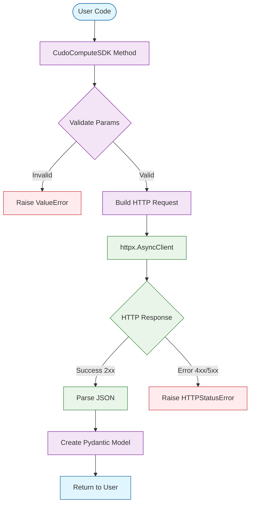
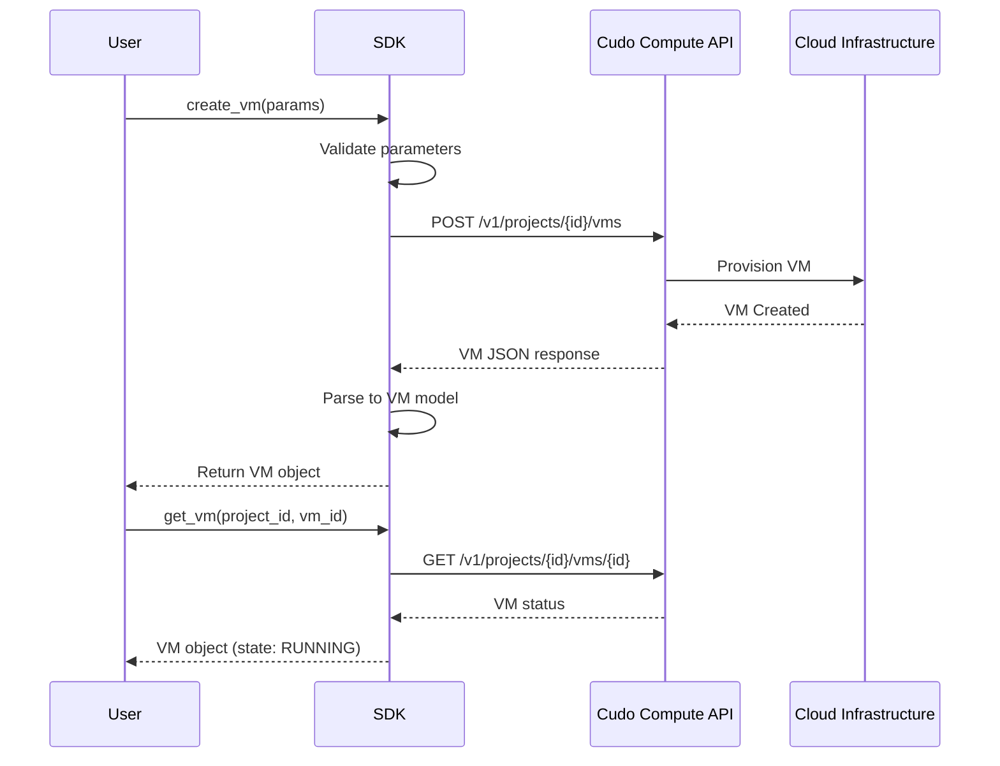

# Architecture

Overview of the SDK's internal structure and design principles.

## Goals

- **Async-first**: Built on `httpx` for efficient async I/O operations
- **Type safety**: Comprehensive Pydantic models for all API responses
- **Clean API**: Intuitive method names following REST conventions
- **Error handling**: Proper HTTP error propagation and handling
- **Minimal dependencies**: Only essential dependencies (httpx, pydantic)

## Module Structure

```text
cudo_compute_sdk/
    __init__.py     # Main CudoComputeSDK class with all API methods
    schema.py       # Pydantic models for all API types
```

### Main Components

#### `CudoComputeSDK` Class

The primary interface to the Cudo Compute API. Handles:
- Authentication via Bearer token
- HTTP request/response lifecycle
- Async client management
- Method organization by resource type

#### `schema.py`

Pydantic models providing:
- Type-safe request/response handling
- Automatic validation
- JSON serialization/deserialization
- IDE autocomplete support

## API Organization

Methods are organized by resource type:

```text
Projects
  ├─ list_projects()
  ├─ get_project()
  ├─ create_project()
  └─ delete_project()

Virtual Machines
  ├─ list_vms()
  ├─ get_vm()
  ├─ create_vm()
  ├─ start_vm()
  ├─ stop_vm()
  ├─ restart_vm()
  └─ terminate_vm()

Data Centers
  ├─ list_data_centers()
  ├─ get_data_center()
  └─ list_machine_types_for_data_center()

Networks
  ├─ list_networks()
  ├─ create_network()
  └─ delete_network()

Security Groups
  ├─ list_security_groups()
  ├─ create_security_group()
  ├─ create_security_group_rule()
  └─ delete_security_group()

Storage
  ├─ list_disks()
  ├─ create_disk()
  ├─ attach_disk_to_vm()
  └─ detach_disk_from_vm()

SSH Keys
  ├─ list_ssh_keys()
  ├─ create_ssh_key()
  └─ delete_ssh_key()
```

## Request Flow



## Authentication

The SDK uses bearer token authentication:

1. API key provided during initialization
2. Added to all requests via `Authorization` header
3. Format: `Bearer {api_key}`

```python
sdk = CudoComputeSDK(api_key="your-api-key")
# All subsequent requests include:
# Authorization: Bearer your-api-key
```

## Error Handling

The SDK propagates HTTP errors using `httpx` exceptions:

```python
from httpx import HTTPStatusError

try:
    vm = await sdk.get_vm(project_id="...", vm_id="...")
except HTTPStatusError as e:
    if e.response.status_code == 404:
        print("VM not found")
    elif e.response.status_code == 401:
        print("Authentication failed")
    elif e.response.status_code == 403:
        print("Permission denied")
    else:
        print(f"API error: {e}")
```

## Type System

All API responses are modeled with Pydantic:

```python
from pydantic import BaseModel, Field

class VM(BaseModel):
    """Virtual Machine model."""
    id: str
    state: Optional[str] = None
    vcpus: Optional[int] = None
    memory_gib: Optional[int] = Field(None, alias="memoryGib")
    gpus: Optional[int] = None
    
    class Config:
        populate_by_name = True  # Allow both snake_case and camelCase
```

Benefits:
- **Validation**: Automatic type checking
- **Documentation**: Self-documenting code
- **IDE Support**: Autocomplete and type hints
- **Serialization**: Easy JSON conversion

## Resource Lifecycle

### VM Creation Example



## Async Design

All network operations are async:

```python
async def example():
    sdk = CudoComputeSDK(api_key="...")
    
    # Concurrent operations
    projects_task = sdk.list_projects()
    datacenters_task = sdk.list_data_centers()
    
    projects, datacenters = await asyncio.gather(
        projects_task,
        datacenters_task
    )
    
    await sdk.close()
```

Benefits:
- Non-blocking I/O
- Efficient resource usage
- Better performance for multiple operations

## Extension Points

The SDK can be extended:

### Custom HTTP Client

```python
import httpx
from cudo_compute_sdk import CudoComputeSDK

# Custom client with different timeout
custom_client = httpx.AsyncClient(
    base_url="https://rest.compute.cudo.org",
    headers={"Authorization": f"Bearer {api_key}"},
    timeout=60.0,
    follow_redirects=True
)

sdk = CudoComputeSDK(api_key=api_key)
sdk.client = custom_client
```

### Logging

```python
import logging

logging.basicConfig(level=logging.DEBUG)
logger = logging.getLogger("cudo_compute_sdk")
```

## Testing

The SDK is designed to be testable:

```python
import pytest
from unittest.mock import AsyncMock, patch

@pytest.mark.asyncio
async def test_list_vms():
    with patch("httpx.AsyncClient.get") as mock_get:
        mock_get.return_value = AsyncMock(
            status_code=200,
            json=lambda: {"VMs": [{"id": "vm-1"}]}
        )
        
        sdk = CudoComputeSDK(api_key="test-key")
        vms = await sdk.list_vms(project_id="test-project")
        
        assert len(vms) == 1
        assert vms[0].id == "vm-1"
```

## Performance Considerations

1. **Connection Pooling**: httpx reuses connections
2. **Async Operations**: Non-blocking I/O
3. **Timeouts**: 30-second default timeout
4. **Resource Cleanup**: Always call `sdk.close()`

## Security

- API keys should be stored in environment variables
- Never commit API keys to version control
- Use `.env` files for local development
- Rotate API keys regularly
- Use project-specific keys when possible
    
    alt Access token valid and not near expiry
        CLI->>API: Auth request with access token
        API-->>CLI: Response
        CLI-->>U: Render output
    else Token needs refresh or missing
        alt Has refresh token
            CLI->>OIDC: Refresh using refresh_token
            alt Refresh successful
                OIDC-->>CLI: New TokenSet
                CLI->>Cache: Persist TokenSet
                CLI->>API: Auth request with new access token
                API-->>CLI: Response
                CLI-->>U: Render output
            else Refresh failed
                Note over CLI,OIDC: Fall back to device code flow
                CLI->>OIDC: Start device code flow
                OIDC-->>CLI: device_code + user_code + verify_uri
                CLI-->>U: Display verification instructions
                loop Poll until authorized or timeout
                    CLI->>OIDC: Poll token endpoint
                    alt User authorized
                        OIDC-->>CLI: TokenSet
                        CLI->>Cache: Persist TokenSet
                    else Still pending
                        OIDC-->>CLI: authorization_pending
                    end
                end
                CLI->>API: Auth request with access token
                API-->>CLI: Response
                CLI-->>U: Render output
            end
        else No refresh token available
            CLI->>OIDC: Start device code flow
            OIDC-->>CLI: device_code + user_code + verify_uri
            CLI-->>U: Display verification instructions
            loop Poll until authorized or timeout
                CLI->>OIDC: Poll token endpoint
                alt User authorized
                    OIDC-->>CLI: TokenSet
                    CLI->>Cache: Persist TokenSet
                else Still pending
                    OIDC-->>CLI: authorization_pending
                end
            end
            CLI->>API: Auth request with access token
            API-->>CLI: Response
            CLI-->>U: Render output
        end
    end
```

Key guarantees:

- No device flow if a valid access token exists.
- Single refresh attempt per command; failures fall back to full device flow.
- Refresh threshold (e.g. < remaining lifetime) triggers proactive renewal.
- Token cache write is atomic (temp file + move) to avoid corruption.
- Abort messages are concise; verbose stack only with `-v`.

## Error Handling

- Domain exceptions map to concise messages
- Traceback only with `-v`
- Non-zero exit on expected user errors

## Models

- TokenSet: access/refresh/expiry
- Persona: identity claims
- Settings: endpoints & client config

## Extensibility

- New command groups = sub-app registration
- Decorators inject settings/persona
- Output helpers unify formatting

## Performance

- Async network calls
- Early return if tokens valid
- Small JSON read/write footprint

## Security

- Token files user-only permissions (expected)
- No token echoing
- Refresh guarded (no infinite retries)

## Future Ideas

- Pluggable credential stores
- Streaming subscriptions (GraphQL)
- Verbose timing metrics per command
